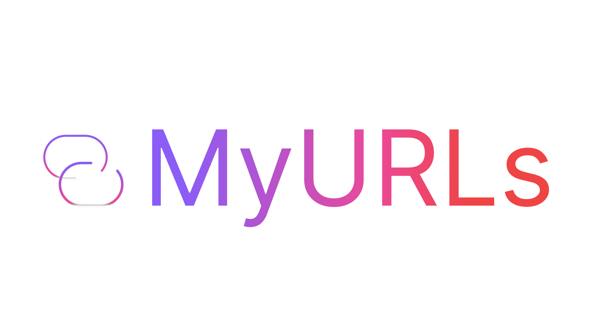
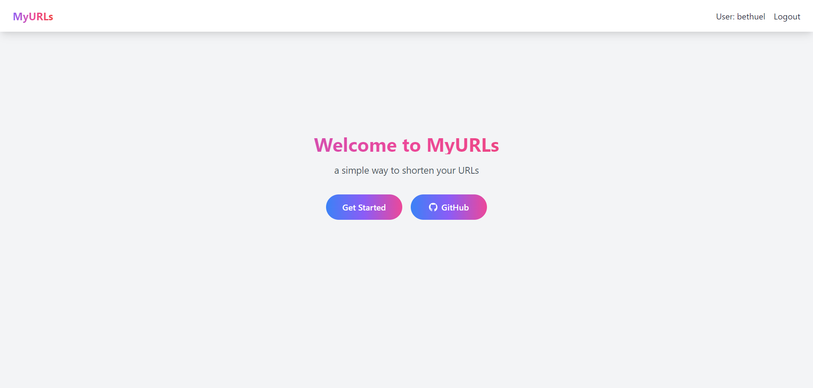
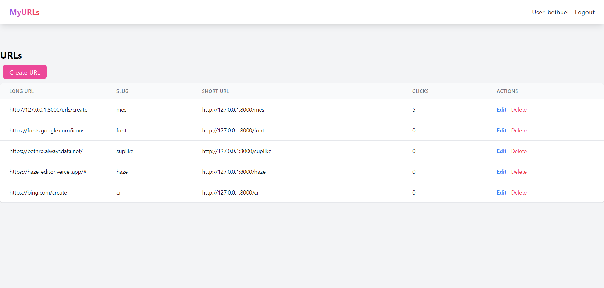
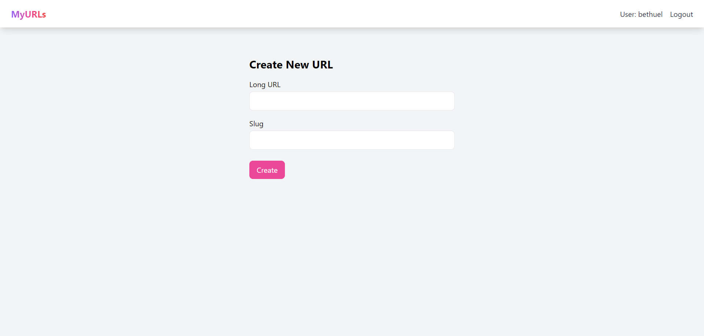

<p align="center"></p>


## About MyURLs

A simple url shortener made with laravel + tailwindcss.

### features
- user authenticatiom
- URL shortening and redirection
- Expiration dates for short URLs
- Click tracking analytics

### preview


welcome screen


dashboard


shortener


### installation

#### 1. Prerequisites:
- Make sure you have PHP version 8+ installed on your system. You can check by running the following in your terminal.
```
php -v
```

- Install Composer, a dependency manager for PHP. You can download it from the official website: https://getcomposer.org/.

- Install MySQL, a popular database system. You can download and install MySQL from the official website: https://dev.mysql.com/downloads/ or You can use a server stack like `Xampp` or `Wamp` which comes pre-installed with PHP and MySQL.

- Visit the official Node.js website: https://nodejs.org/. Download the appropriate installer for your operating system and run it. Run the following command to verify that Node.js and npm are installed: 
```
node -v
npm -v
```


#### 2. Clone the repository:

Open your terminal and navigate to the directory where you want to install the app.
Run the following command to clone the repository: 

```
git clone https://github.com/bethropolis/myurls.git
```

#### 3. Install dependencies:

Navigate into the app's directory: 

```bash
 cd myurls
 ```

Run the following command to install the app's dependencies using Composer and npm:

```bash
# composer
composer install 
# npm
npm install
```

#### 4. Configure the environment:

Make a copy of the `.env.example` file and rename it to `.env`:
```
 cp .env.example .env
 ```


#### 5. Generate an application key:

```bash
 php artisan key:generate
```

#### 6. Set up the database:

Create a new database called `myurls` onto your database manually.
If you have mysql environment installed you can run.
```bash
mysql -u your_username -p -e "CREATE DATABASE myurls;"
```
Update the `.env` file with the necessary database credentials: 
```
DB_CONNECTION=mysql 
DB_HOST=127.0.0.1 
DB_PORT=3306 
DB_DATABASE=myurls
DB_USERNAME=your_database_username
DB_PASSWORD=your_database_password
```
> note: your'll need to create the database called `myurls` or any other name according to the value of `DB_DATABASE`.

#### 7. Migrate and seed the database:

Run the following command to migrate the database tables: 
```bash
php artisan migrate
```

#### 8. Serve the application:
   
Run the following command to start the Laravel development server & vite server: 
```bash
npm run dev
php artisan serve
```
The app will be accessible at `http://localhost:8000` in your browser.

That's it! You've successfully installed the app.


## Intension
I made this project to learn more about Laravel (so far I'm Loving it).

## License
My favourite license, [MIT license](https://opensource.org/licenses/MIT) 
